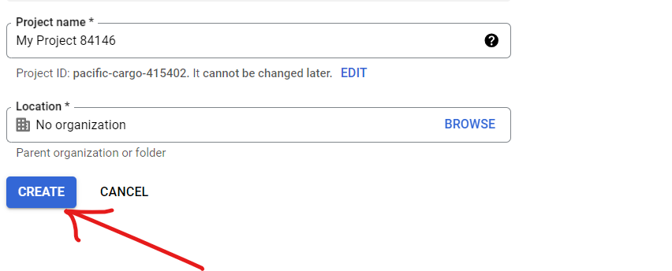
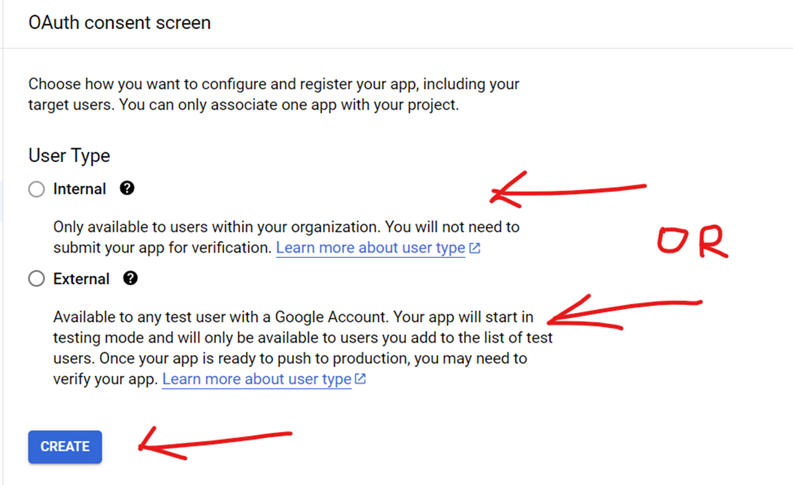
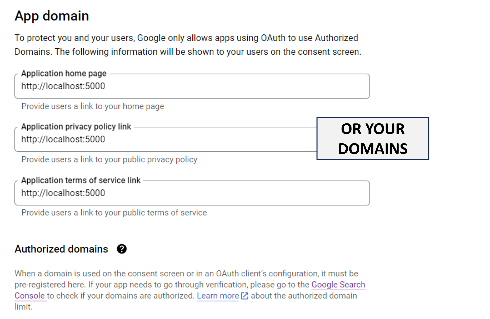
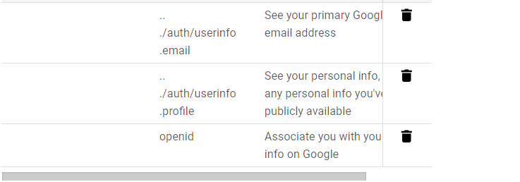

<h1>Tutorial OAuth Google App Flask</h1>

    Steps to create the app in Google Cloud Console

    <a href="https://console.cloud.google.com/projectcreate">Link Google Cloud Console Create Project</a>

Add in file app_config!

